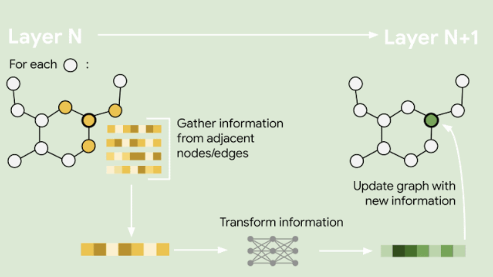
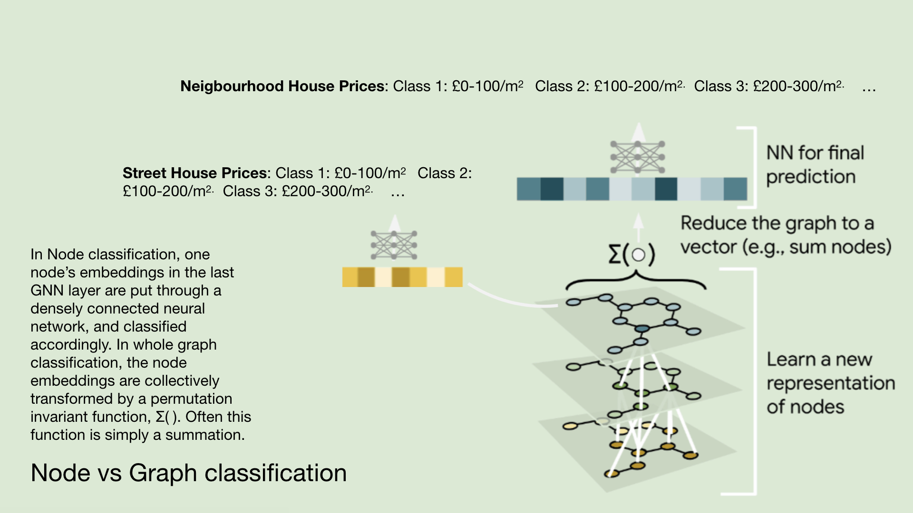

# Graph Neural Networks for Street-Level House Price Prediction

A Rust implementation of Graph Neural Networks (GNNs) for urban house price prediction, based on the research approach described in "Cities as Graphs". This project demonstrates how street networks can be modeled as graphs and analyzed using machine learning for urban planning and economic applications.


*Figure 1: Representation of city neighborhoods as graphs, where streets are nodes and edges represent connections between streets. Each node contains a feature vector encoding street-level information.*


*Figure 2: Graph Neural Network layers enable each node to learn from adjacent nodes through message passing. Information is transformed iteratively to create rich node representations.*


*Figure 3: For each node, the GNN collects information from adjacent nodes and transforms it to generate new node representations. This process captures neighborhood effects crucial for house price prediction.*


*Figure 4: Complete GNN workflow for street-level house price prediction. Street networks are translated into graphs, processed through GNN layers to learn neighborhood representations, then reduced to final price predictions.*


*Figure 5: Example visualization of GNN-based urban analysis showing how the model learns to distinguish different neighborhood characteristics and price patterns across a city street network.*


## 🏗️ Architecture

This implementation uses the [Burn](https://burn.dev/) machine learning framework with WGPU backend for GPU acceleration. The core components include:

### 1. Graph Representation (`src/graph.rs`)
- **Nodes**: Street segments with urban features (building characteristics, land use, etc.)
- **Edges**: Physical connections between streets
- **Features**: 16-dimensional feature vectors per node including:
  - Year built, building area, number of floors
  - Commercial/residential/industrial area ratios
  - Lot dimensions and characteristics


### 2. Graph Convolutional Layers
- Implements the GCN approach from Kipf & Welling (2017)
- Message passing between neighboring street segments
- Multiple hidden layers for learning complex urban patterns

### 3. Node Classification
- Predicts house price categories (5 classes from Low to High)
- Uses softmax output for probability distributions
- Includes autodiff support for training


## 🎯 Key Features

- **Street Network Modeling**: Represents urban areas as graphs where streets are nodes
- **Neighborhood Learning**: GNN layers allow each street to learn from its connected neighbors
- **Urban Feature Integration**: Incorporates multiple urban characteristics per street segment
- **GPU Acceleration**: Uses WGPU backend for efficient tensor operations
- **Autodiff Support**: Full backward pass implementation for training

## 🚀 Usage

Run the demonstration:

```bash
cargo run --bin run --release
```

This will execute three main demonstrations:

1. **GNN Inference Demo**: Shows predictions for a sample 6-street network
2. **GNN Autodiff Demo**: Demonstrates forward and backward passes
3. **Original Kernel Demo**: Compares custom vs reference implementations


## 📊 Sample Output

```
=== Graph Neural Network Inference Demo ===
Created street network with 6 nodes (streets)
Node features dimension: 16

GNN Predictions for each street:
(Probability distribution over 5 price categories: Low -> High)
Predictions shape: [6, 5]

Sample Street Network Topology:
Street 0 <-> Street 1, Street 2
Street 1 <-> Street 0, Street 2, Street 3
Street 2 <-> Street 0, Street 1, Street 3, Street 4 (central hub)
Street 3 <-> Street 1, Street 2, Street 4, Street 5
Street 4 <-> Street 2, Street 3, Street 5
Street 5 <-> Street 3, Street 4

Ground Truth Labels:
Street 0: Low-Med (category 1)
Street 1: Medium (category 2)  
Street 2: High (category 4)
Street 3: Low (category 0)
Street 4: Low-Med (category 1)
Street 5: Medium (category 2)
```

## 🧠 Research Background

This implementation is based on the research paper's key insights:

### Problem Statement
Traditional house price prediction models treat properties in isolation, missing the crucial spatial relationships that determine value. The "neighborhood effect" is difficult to quantify using conventional approaches.

### GNN Solution
Graph Neural Networks can naturally model:
- **Spatial Relationships**: Direct encoding of street connectivity
- **Neighborhood Effects**: Message passing allows distant streets to influence predictions
- **Urban Features**: Rich node features capture local characteristics
- **Scalability**: Can handle city-scale networks efficiently

### Mathematical Foundation
The core GCN layer implements:
```
H^(l+1) = σ(Â * H^(l) * W^(l))
```
where:
- `Â` is the normalized adjacency matrix (street connections)
- `H^(l)` are node features at layer l
- `W^(l)` are learnable parameters
- `σ` is an activation function (ReLU)


## 🏙️ Real-World Applications

This approach could be extended for:

1. **Urban Planning**: Identify undervalued neighborhoods for development
2. **Investment Analysis**: Predict areas with growth potential
3. **Policy Impact**: Model how infrastructure changes affect property values
4. **Market Analysis**: Understand spatial patterns in housing markets
5. **Risk Assessment**: Identify areas vulnerable to price volatility

## 🔧 Technical Implementation Details

### Graph Construction
- Sample network represents a small neighborhood with 6 intersecting streets
- Adjacency matrix encodes physical street connections
- Self-loops added for GCN normalization

### Feature Engineering
Each street node includes:
- **Temporal**: Year built, time since refurbishment
- **Physical**: Building dimensions, floor area ratios
- **Functional**: Land use mix (residential/commercial/industrial)
- **Spatial**: Lot characteristics and frontage

### Model Architecture
- Input layer: 16 features per node
- Hidden layers: 32 → 16 dimensions
- Output layer: 5 price categories
- Activation: ReLU for hidden layers, Softmax for output

## 🎓 Academic Context

This implementation demonstrates several key concepts from the research:

1. **Graph Representation Learning**: Converting urban networks to learnable structures
2. **Spatial Machine Learning**: Incorporating geographic relationships in ML models  
3. **Urban Analytics**: Data-driven approaches to understanding city dynamics
4. **Neighborhood Effects**: Quantifying how local context affects property values

## 🔬 Future Extensions

Potential improvements could include:

- **Proper Normalization**: Implement full symmetric adjacency normalization
- **Edge Features**: Add street characteristics (width, traffic, quality)
- **Temporal Dynamics**: Model price changes over time
- **Hierarchical Graphs**: Multi-scale representation (streets → districts → city)
- **Real Data Integration**: Connect to actual urban datasets
- **Advanced Architectures**: Graph Attention Networks, GraphSAGE variants

## 🛠️ Dependencies

- **Burn 0.18.0**: Core ML framework with autodiff and GPU support
- **CubeCL**: GPU compute abstraction layer
- **WGPU**: Cross-platform GPU API
- **Serde**: Serialization support

## 📚 References

The implementation follows the methodology described in the research paper "Cities as Graphs", which proposes using Graph Neural Networks for urban house price prediction by modeling street networks as mathematical graphs where spatial relationships can be learned through message passing algorithms.

---

*This project demonstrates the intersection of machine learning, urban planning, and spatial analysis, showing how modern AI techniques can provide new insights into complex urban systems.* 